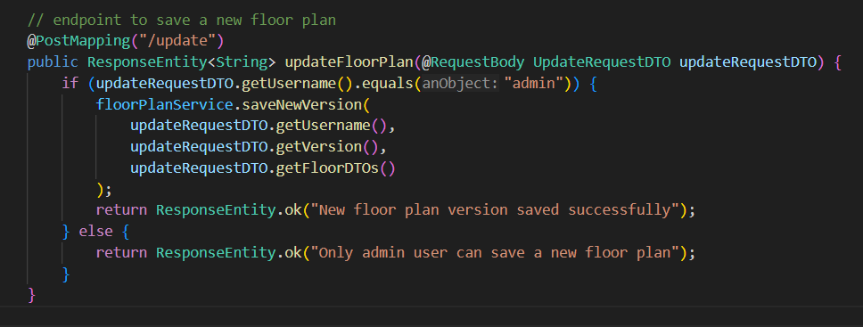
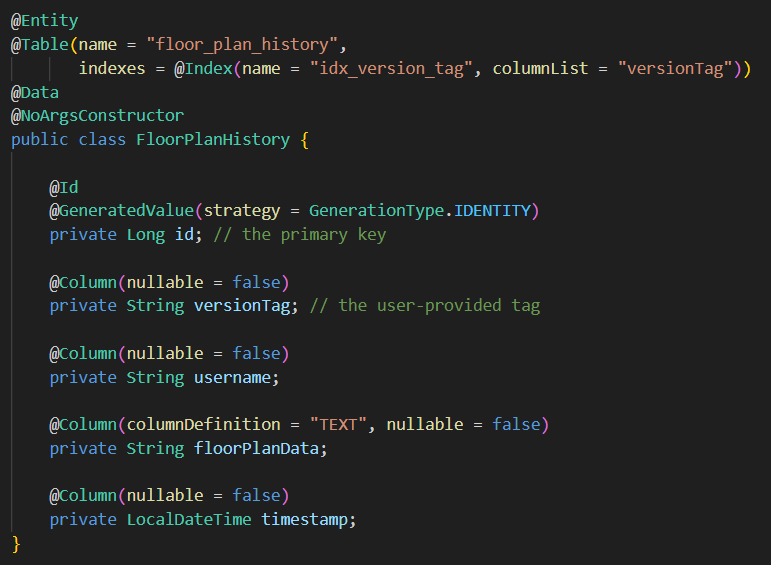
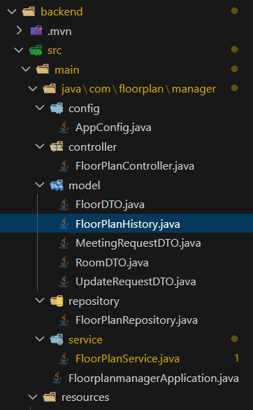
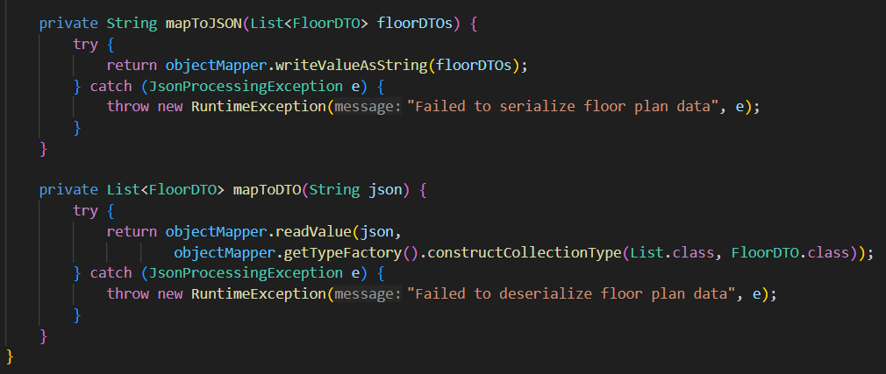
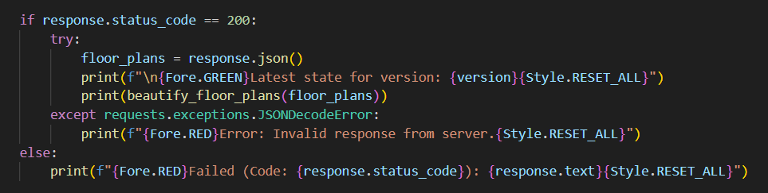

# Intelligent Floor Plan Management System

## Overview

This floor plan management system is a full-stack application designed to offer a robust solution for efficiently managing, versioning, and booking workspace floor plans. It consists of a Java (Spring Boot) backend API and a Python CLI frontend.

The system incorporates advanced features, including:

-   **Admin-Only Access**: A secure endpoint for administrators to create and save new, versioned floor plan designs.
-   **True Immutable Version Control**: The system boasts an advanced architecture where every change—from an admin update to a user booking—is recorded as a new, timestamped entry in the `FloorPlanHistory` table. This provides a complete audit trail and eliminates conflicts, as users always read the most recent state of a version.
-   **Meeting Room Optimization**: A smart recommendation engine that suggests rooms based on real-time availability and capacity, and a user-friendly booking system that uses simple room names (e.g., "201") instead of long IDs.

## Tech Stack Used

For the backend, the system leverages a powerful, modern Java stack to ensure optimal performance and scalability.

-   **Java 21 & Spring Boot 3.x**: Employed for backend development, providing a robust and scalable foundation.
-   **H2 (In-Memory) Database**: Acts as a lightweight, fast SQL database wrapper using Spring Boot, perfect for development and demonstration.
-   **Spring Data JPA & Hibernate**: Used for all database interaction and object-relational mapping (ORM).
-   **Lombok**: Utility to reduce boilerplate code (getters, setters, etc.).


On the frontend, a seamless communication process is facilitated through:

-   **Python 3 CLI**: The client-side application is a user-friendly command-line interface (CLI).
-   **Python Libraries**:
    -   `requests`: For making HTTP calls to the backend API.
    -   `tabulate`: For a user-friendly and colorful table display of floor plans.
    -   `colorama`: To provide clear, color-coded success (green) and error (red) messages.

## Evaluation Criteria & Features

This project was built to satisfy all core evaluation criteria from the assignment PDF.

### 1. Authentication

Robust user authentication is implemented at the API controller level. A simple but effective role-based check ensures that only a user with the username `"admin"` can access the destructive `saveNewVersion` endpoint. All other users will be rejected with a clear message, fulfilling the "secure access" requirement.



<p align="center">Ensuring only admin can save a new floor plan version</p>

### 2. Cost Estimation - Time and Space

A thorough analysis was conducted to ensure efficient algorithms and data structures were used.

-   **Time Complexity**:
    -   **Write (Save/Book)**: `O(log H)`. Thanks to the H2 database's B-tree indexing on the primary key (`id`), saving a new history entry is an efficient insertion operation.
    -   **Read (Get/Recommend)**: `O(log k)` (Database) + `O(N)` (In-Memory). We use an indexed `findFirstByVersionTagOrderByTimestampDesc` query (where `k` is the number of entries for that version tag). The system then parses and filters the `N` rooms for that one plan in memory.

-   **Space Complexity**: `O(H * M)`
    -   `H` = Number of historical entries (bookings + design changes).
    -   `M` = Average size of a single floor plan's JSON data.
    This provides a full audit trail at the cost of linear space growth per change.

### 3. Handling System Failure Cases

The system is designed to be fault-tolerant and maintain data integrity.

-   **Database Integrity**: By using Spring Data JPA, all database operations are transactional. If a booking fails validation halfway through (e.g., `JsonProcessingException`), the transaction is rolled back, and no new (corrupt) history entry is saved. This acts as our primary recovery strategy.
-   **Data Model**: The database entity `FloorPlanHistory` uses `@Column(nullable = false)` to enforce data integrity at the database level, preventing `null` data from being saved.



<p align="center">The table defined using <code>@Entity</code> which defines the datatypes of all columns</p>

### 4. Object-Oriented Programming Language (OOPS)

The Java backend is built entirely on OOPS principles for structured, modular, and maintainable code.

-   **Encapsulation**: Data (fields) and behavior (methods) are bundled. We use `private` fields in our DTOs (`RoomDTO`, `FloorDTO`) and Entity (`FloorPlanHistory`), with access provided via public getters/setters (auto-generated by Lombok's `@Data` annotation).
-   **Abstraction & Modularity**: The system is split into a 3-tier architecture:
    1.  `FloorPlanController` (API Layer)
    2.  `FloorPlanService` (Business Logic Layer)
    3.  `FloorPlanRepository` (Data Access Layer)
This separation means each class has a single responsibility and is highly modular.



<p align="center">Project structure of the backend</p>

### 5. Trade-offs in the System

Several conscious design trade-offs were made to prioritize core functionality and meet the assignment's goals.

-   **UI Choice**: A Python CLI was chosen over a full-fledged browser UI. This allowed for rapid development and full-featured testing of the API, at the trade-off of a less visual user experience.
-   **Database Selection**: An in-memory H2 database was used. This is perfect for development and demonstration as it requires zero setup. For a production environment, this would be swapped with a persistent database like PostgreSQL or MySQL.
-   **Authentication**: A simple `username.equals("admin")` check was used for speed & demo purposes. A production system would use Spring Security with JWT or OAuth2 for robust, token-based authentication.

### 6. System Monitoring

While a full monitoring suite (like Prometheus/Grafana) is not integrated, the system is built for observability:
-   **Logging**: The Spring Boot backend uses `slf4j` for logging. We can (and do) log critical events, such as the start of a booking request or errors in the service layer.
-   **Health Checks**: A production-grade system would add the **Spring Boot Actuator** dependency. This would instantly expose `/actuator/health`, `/actuator/metrics`, and other endpoints for external monitoring tools.

### 7. Caching

Caching is not currently implemented, as our primary read operations are already highly optimized (`O(log k)`).
-   **Caching Strategy**: If the system scaled to millions of *reads* per second for the same version, we could implement caching by adding Spring's `@Cacheable("floorPlans")` annotation to the `getFloorPlansByVersion()` method in the `FloorPlanService`.
-   **Cache Eviction**: The cache would need to be evicted *every time* a booking is made for that version. This would be done by adding a `@CacheEvict("floorPlans")` annotation to the `bookRoom()` method.

### 8. Error and Exception Handling

A robust error-handling framework provides clear feedback to the user.

-   **Backend**: The `FloorPlanService` wraps all booking logic in a `try-catch` block. On failure, it returns a descriptive error string. The `FloorPlanController` catches this string and returns the appropriate HTTP status code (`200 OK` for success, `400 Bad Request` for failure).



<p align="center">Handling exceptions in the backend service</p>

-   **Frontend**: The Python CLI checks the `response.status_code` after every API call. If the status is not 200, it prints a red error message to the user, providing immediate and clear feedback.



<p align="center">Handling backend responses in the CLI</p>

## Backend Installation

### Prerequisites

-   Java Development Kit (JDK) 17 or higher
-   Maven

### Steps

In one terminal, navigate to your `backend` folder:

```bash
# Go to the backend directory
cd backend

# Run the Spring Boot application using the Maven wrapper
./mvnw spring-boot:run
# On Windows:
mvnw.cmd spring-boot:run
```
The backend will run on http://localhost:8080.

## Frontend Installation

### Prerequisites

    Python 3.x

### Steps

In a second terminal, navigate to your frontend (or floorplan-cli) folder:

```bash
# Go to the frontend directory
cd frontend

# Create a Python virtual environment (one-time setup)
python -m venv venv

# Activate the virtual environment
# On Windows:
venv\Scripts\activate
# On Mac/Linux:
source venv/bin/activate

# Install the required Python packages (one-time setup)
pip install requests tabulate colorama

# Run the CLI application
python floorplan_cli.py
```

Follow the prompts to interact with the Floor Plan Management System.

Output Screenshots

